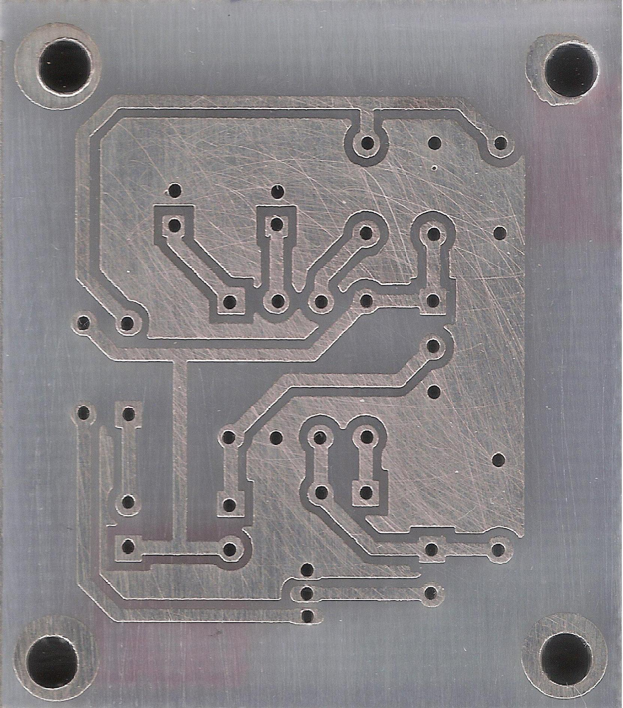
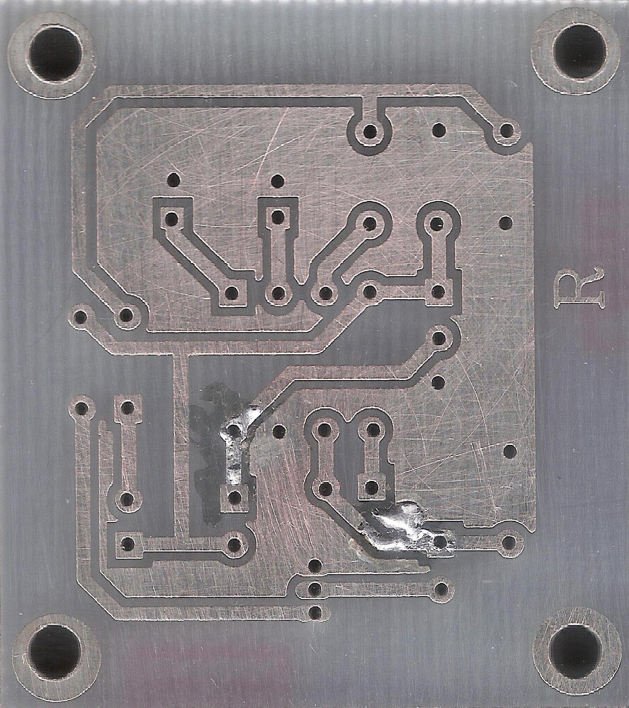
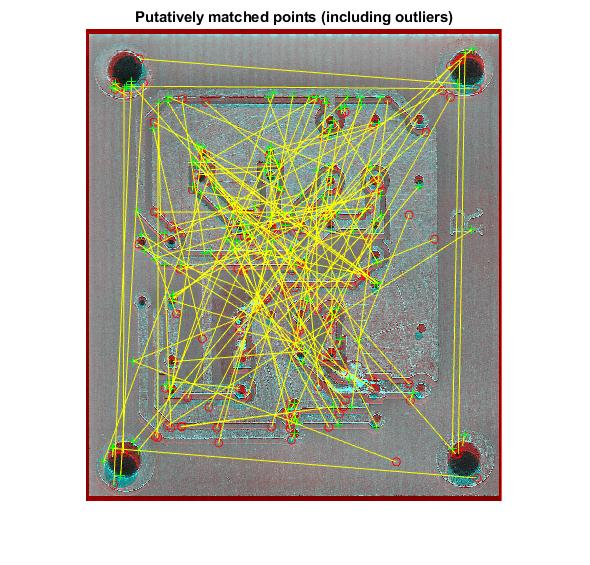
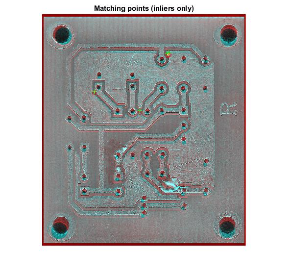
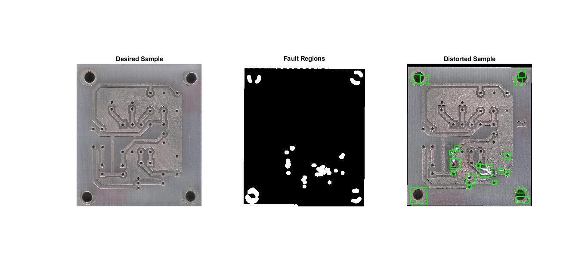

# PCB Fault Detection
A simple project to detect faults in the PCBs using image processing tools


## Running the tests

simply run ```PCB_prj``` to see who it is work

## Results
| Image1 | Image2 |
| ------ | ------ |
|  |  |

| Initial Macthing | Inliers |
| ------ | ------ |
|  |  |
    
| Final Results |	
| ---------------- |
| |


## Authors

* **Ehsan Mirsadeghi**
